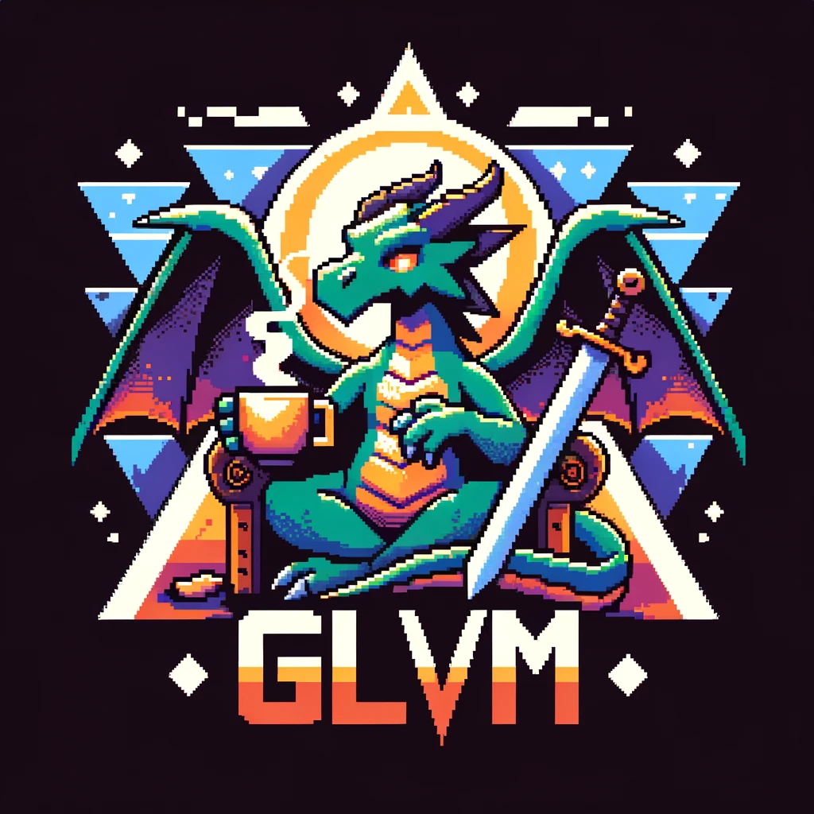

# Game Loop Versatile Modules (GLVM)

This is my simple game engine for Linux and Windows OS's with both Vulkan and Opengl support. Its based on entity component system (ECS) with user friendly C++ interface. Also it has partial support of GLTf and wavefront.obj 3D model formats. With GLVM you can make simple phong light of three types (directional, spot, point). Very basic physics included (collitions, gravity). 

## Linux
    
* ### Development libraries:

        X11, Xi, XRandR.

        Vulkan.

        Opengl.
    
        Alsa.

        pulseaudio.

* ### Repository specific:
* #### Gentoo:
        emerge --ask x11-libs/libX11 \
                     x11-libs/libXi \
                     x11-apps/xrandr \
                     media-libs/vulkan-loader \
                     dev-util/vulkan-tools \
                     media-libs/mesa \
                     media-libs/alsa-lib \
                     media-sound/pulseaudio

* #### Debian:
        apt install libx11-dev \
                    libxi-dev \
                    libxrandr-dev
                    libgl1-mesa-dev \
                    libasound2-dev \
                    libpulse-dev \
                    libudev-dev

* #### Arch:
        pacman -S libxi \
                  libxrandr \
                  mesa \
                  libglvnd \
                  alsa-lib \
                  pulseaudio

* #### Fedora:
        dnf install libX11-devel \
                    libXrandr-devel \
                    libXi-devel \
                    mesa-libGL-devel \
                    alsa-lib-devel \
                    pulseaudio-libs-devel \
                    libudev-devel \
                    libstdc++-static
  
## Windows

* ### Development libraries:

        Vulkan
        
        Opengl

* ### Specific tools:
* #### First of all you need MSYS2:
        You can get it from official website (https://www.msys2.org/) or

         winget install MSYS2.MSYS2

* #### Then get needed compiler tools and Vulkan:
  Inside MSYS2 for simplier way of installing packages frist of all we need to install pactoys:

      pacman -S pactoys

  Now we can use just shortened names of packages inside any MSYS2 toolchain:

      pacboy -S gcc:p
      pacboy -S vulkan:p

 ## Building GLVM:
    1. In main project firectory create directory called "build".
    2. Then copy to main directory preffered Makefile depends on operating system from Makefiles/Lin or Makefiles/Win.
       If you building from Windows you can choose one of the four make files to build inside cmd, power shell, ucrt MSYS2 or
       clang64 MSYS2 toolchain.
    3. After copying make file type next command in project main directory from inside cmd, poiwer shell or MSYS2 terminal:

           make -f Makefile

       where "Makefile" - is a make file you choosen.

# License
Copyright © 2024 Maksim Manokhin a.k.a. Yuriorkis_Scream. Contacts: <fellfrostqtw@gmail.com>
